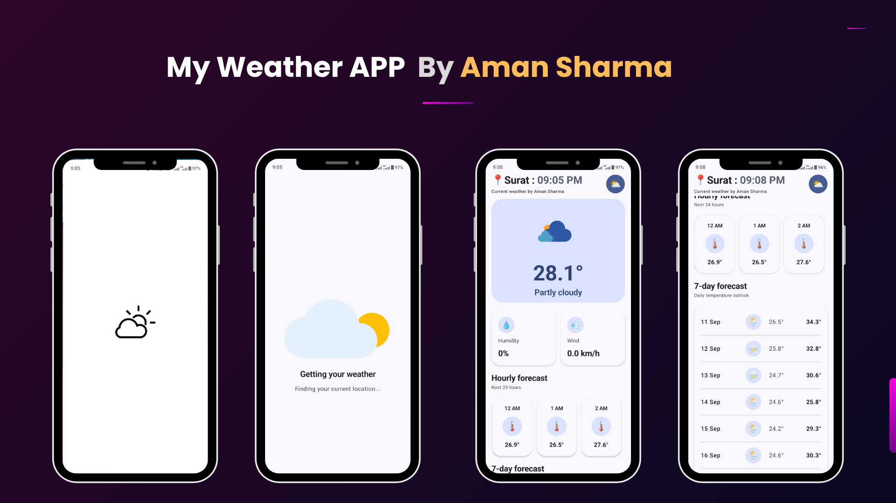

# My Weather App

A modern Android weather application built with Kotlin and Jetpack Compose. The app uses the device's current location to provide current weather conditions, hourly forecasts, and daily forecasts.

## Features

- Current weather based on device location
- Hourly and daily weather forecasts
- Temperature, humidity, wind, and weather conditions
- Location permission handling
- Loading, success, and error state handling
- Material 3 UI
- Weather animations with Lottie

## Technologies

- Kotlin
- Jetpack Compose
- Material 3
- MVVM Architecture
- Repository Pattern
- Android ViewModel
- Kotlin Coroutines
- StateFlow / MutableStateFlow
- Hilt
- KSP
- Retrofit
- Gson
- Google Fused Location Provider
- Android Geocoder
- Lottie Compose
- AndroidX SplashScreen
- Java 17
- Gradle

## APIs & Services

- **Open-Meteo API** — Current weather and forecast data
- **Fused Location Provider** — Device location
- **Android Geocoder** — Location name from coordinates

## Project Highlights

The project focuses on a clear separation between the UI, ViewModel, repository, networking, location handling, and data models. Jetpack Compose is used for the UI, StateFlow for reactive state management, Coroutines for asynchronous operations, Retrofit for API communication, and Hilt for dependency injection.

## Developer

[Engineer Aman Sharma](https://www.linkedin.com/in/engineer-aman-sharma)